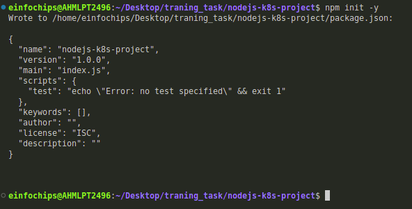
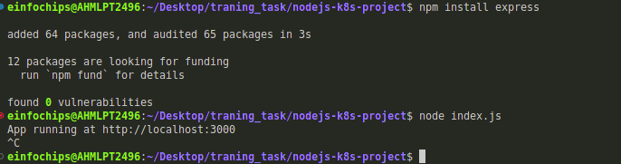
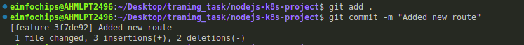
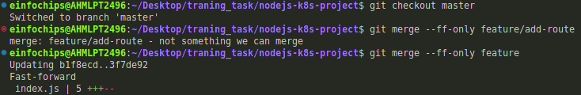
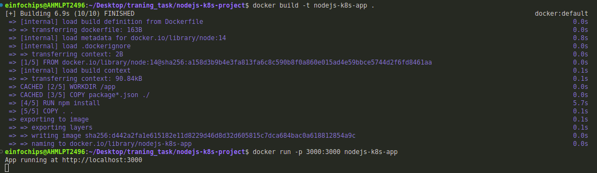
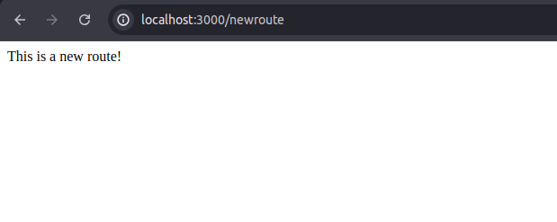
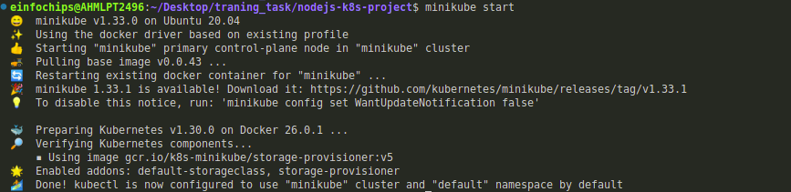
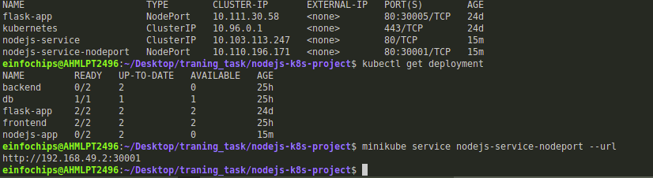
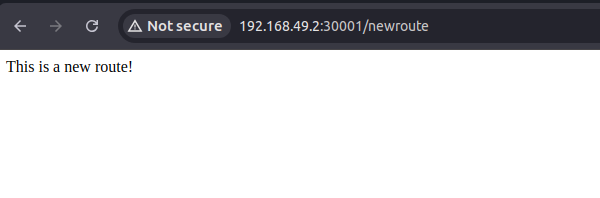
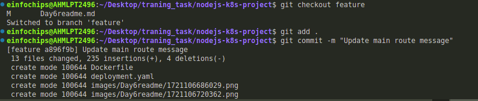

**### Project 01

### Deploying a Node.js App Using Minikube Kubernetes

#### Overview

This project guides you through deploying a Node.js application using Minikube Kubernetes. You'll use Git for version control, explore branching and fast-forward merges, and set up Kubernetes services and deployment pods, including ClusterIP and NodePort service types.

#### Prerequisites

* Minikube installed
* kubectl installed
* Git installed
* Node.js installed ([https://nodejs.org/en/download/package-manager/all#debian-and-ubuntu-based-linux-distributions](https://nodejs.org/en/download/package-manager/all#debian-and-ubuntu-based-linux-distributions))

#### Project Steps

### 1. Set Up Git Version Control

1.1. Initialize a Git Repository

Create a new directory for your project:

mkdir nodejs-k8s-project

cd nodejs-k8s-project

**

**Initialize a Git repository:

git init

1.2. Create a Node.js Application

Initialize a Node.js project:

npm init -y

Install Express.js:

npm install express

**

**1.3. Commit the Initial Code

Add files to Git:

git add .

Commit the changes:

git commit -m "Initial commit with Node.js app"**

**### 2. Branching and Fast-Forward Merge

2.1. Create a New Branch

Create and switch to a new branch feature/add-route:

git checkout -b feature/add-route

**

**2.2. Implement a New Route

Modify index.js to add a new route:

app.get('/newroute', (req, res) => {

res.send('This is a new route!');
});

Commit the changes:

git add .

git commit -m "Add new route"

**

**2.3. Merge the Branch Using Fast-Forward

Switch back to the main branch:

git checkout main

Merge the feature/add-route branch using fast-forward:

git merge --ff-only feature/add-route

Delete the feature branch:

git branch -d feature/add-route

**

**### 3. Containerize the Node.js Application

3.1. Create a Dockerfile

Create a Dockerfile with the following content:

FROM node:14

WORKDIR /app

COPY package\*.json ./

RUN npm install

COPY . .

EXPOSE 3000

CMD ["node", "index.js"]

3.2. Build and Test the Docker Image

Build the Docker image:

docker build -t nodejs-k8s-app .

Run the Docker container to test:

docker run -p 3000:3000 nodejs-k8s-app

1. Access http://localhost:3000 to see the app running.

**

Ouput:

**### 4. Deploying to Minikube Kubernetes

4.1. Start Minikube

Start Minikube:

minikube start**

**4.3. Apply Manifests to Minikube

Apply the deployment:

kubectl apply -f deployment.yaml

Apply the ClusterIP service:

kubectl apply -f service.yaml

Apply the NodePort service:

kubectl apply -f service-nodeport.yaml

4.4. Access the Application

Get the Minikube IP:

minikube ip

Access the application using the NodePort:

curl http://<minikube-ip>:30001**

by hitting the ip :

**### Making Changes to the App and Redeploying Using Kubernetes

### 6. Making Changes to the Node.js Application

6.1. Create a New Branch for Changes

Create and switch to a new branch feature/update-message:

git checkout -b feature/update-message

6.2. Update the Application

Modify index.js to change the message:

const express = require('express');

const app = express();

const port = 3000;

app.get('/', (req, res) => {

res.send('Hello, Kubernetes! Updated version.');
});

app.get('/newroute', (req, res) => {

res.send('This is a new route!');
});

app.listen(port, () => {

console.log(\`App running at http://localhost:\${port}\`);
});

6.3. Commit the Changes

Add and commit the changes:

git add .

git commit -m "Update main route message"

**

**### 7. Merge the Changes and Rebuild the Docker Image

7.1. Merge the Feature Branch

Switch back to the main branch:

git checkout main

Merge the feature/update-message branch:

git merge --ff-only feature/update-message

Delete the feature branch:

git branch -d feature/update-message

7.2. Rebuild the Docker Image

Rebuild the Docker image with a new tag:

docker build -t nodejs-k8s-app:v2 .

**
